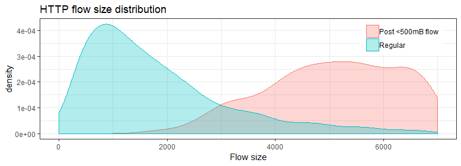

It all started when my father taught me some notions of Visual Basic, and with the priceless help of the code completion tool (yeah, no Google at that time). Since then, I've been enjoying coding and here you can find some of the programs I've written.

### Research

* [**Bidirectional LSTMs for access attack detection**](https://hc2116.github.io/docs/MLN20.pdf) 
In this project, we wanted to explore how much we can leverage common sequential network flow structures to create a model that detects low-volume access attacks. The underlying idea is that flow sequences corresponding to individual actions such as web-browsing follow very strong and repetitive structures, such as small HTTP-flows normally being followed by larger HTTP-flows.

<!-- | -->

<!--   -->
   
   

For this, we built a bidirectional LSTM-network with $$\\approx$$ 10.000 parameters that learns a language model of flow sequences, with flows acting as word tokens according to their destination port, direction, and size. Our consideration is that these structures can help detect low-volume attacks such as Heartbleed or SQL-injections which deviate from these structures by exploiting vulnerabilities. 

  
   

* [**ConnectionSeq-to-connectionSeq model**](http://www.vision.ee.ethz.ch/~cvlsegmentation/cob/) 
State of the art in contour detection, hierarchical segmentation, and object proposals. Runs in 700 miliseconds on a GPU and a single CPU thread, thanks to a novel sparse representation of the segmentation results. From our ECCV 2016 paper.

* [**Multiscale Combinatorial Grouping**](http://www.eecs.berkeley.edu/Research/Projects/CS/vision/grouping/mcg/) 
Method for producing segmented object proposals, state of the art pre deep learning. Given an image, it computes around 5000 proposals of segmented objects in less than 30 seconds on a single thread. From our CVPR 2014 and TPAMI 2016 papers.

* [**SEISM: Supervised Evaluation of Image Segmentation Methods**](http://www.vision.ee.ethz.ch/~biwiproposals/seism/index.html) 
Toolbox to benchmark image segmentation methods, including our newly-proposed objects and parts measure. From our PAMI 2015 and CVPR 2013 papers.

* [**Supervised Assessment of Segmentation Hierarchies**](https://imatge.upc.edu/web/resources/supervised-assessment-segmentation-hierarchies) 
Toolbox to find the best cuts in a hierarchy of regions using combinatorial optimization and solved by CPLEX. From our ECCV 2012 paper.
 
### Didactical

* [**Solving Sudokus like a Pro**](http://jponttuset.github.io/solving-sudokus-like-a-pro-1/) 
Code to capture a camera feed, locate a Sudoku grid, find and recognize the numbers, solve it in real time, and overlay the results.

* [**Web Scraping**](http://jponttuset.github.io/deep-learning-scraping/) 
Demo to answer whether deep learning is indeed in fashion in computer vision. The code scrapes the paper titles of latest vision conferences from the web and computes the percentage of *deep-learning-related* papers.

### Web

* [**Boosting Object Proposals: From Pascal to COCO**](http://www.vision.ee.ethz.ch/~biwiproposals/boosting-coco/) 
Webpage to showcase the results of our publication. It involved a decent amount of JavaScript, D3.js, PHP, and MySQL.

* [**DAVIS Dataset**](https://graphics.ethz.ch/~perazzif/davis/index.html) 
Webpage to showcase the benchmark results of DAVIS and browse results. Again: JavaScript, D3.js, PHP, and MySQL.

